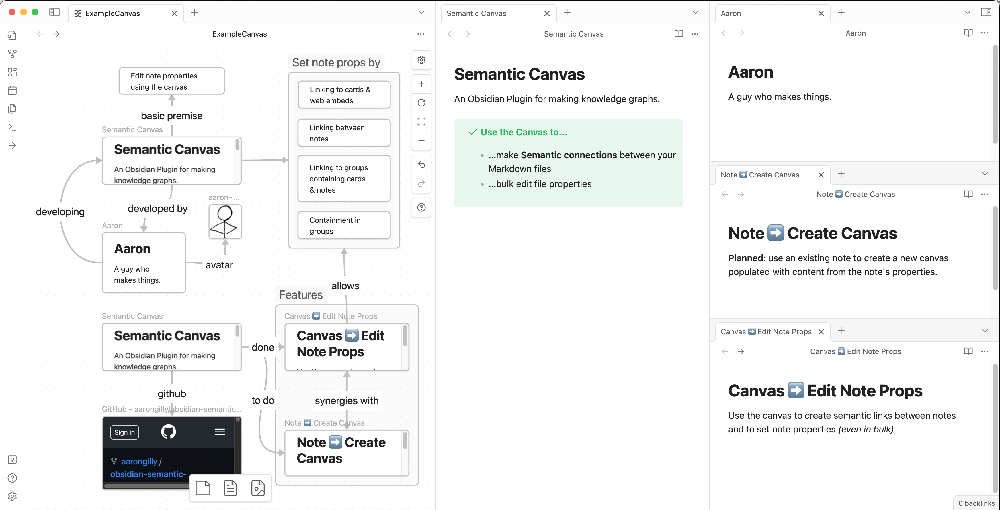
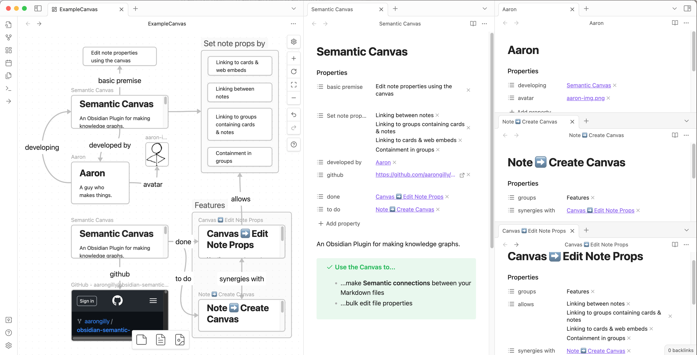
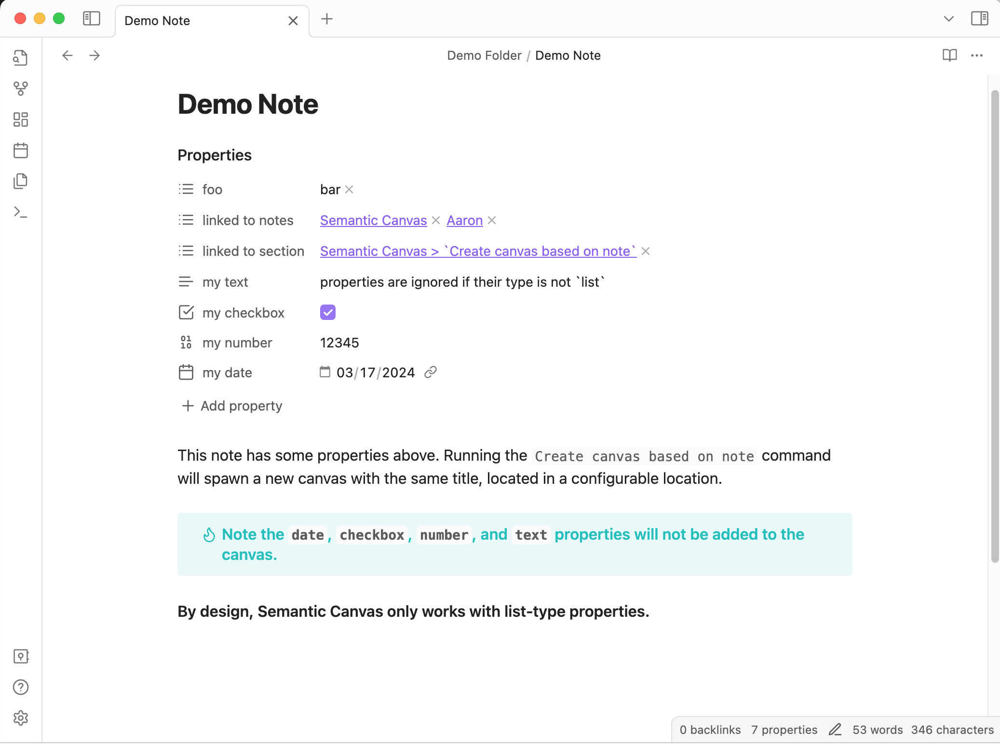
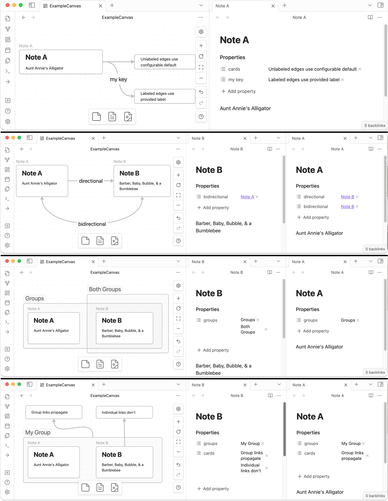

# Obsidian Semantic Canvas Plugin

This is a plugin for [Obsidian](https://obsidian.md) gives canvases the power to edit file properties *visually*.

Set properties for all Markdown files included in your canvas based on their group membership, links to files, links to cards, and links to web embeds. Create new properties or edit existing ones on multiple markdown notes at once through the canvas. Create **semantic links** *(aka typed links or labeled links)* between notes and work with them using an intuitive graph-based approach. Use notes to create canvases. Use canvases to update notes.

## Example Screenshots

### Canvas → Edit Note Props
One command to make this canvas:

Update properties of all the notes on it:

### Note → Create Canvas
Another command to turn this note:

Into a new canvas containing its `list-type` properties:

## Use Cases
- Building & representing knowledge graphs
- Mass editing properties
- Venn Diagrams & Kanbans

## Usage
Open a canvas then use command palette or file menu to run either:
- `Semantic Canvas: Append Note Properties based on Canvas` 
- `Semantic Canvas: Overwrite Note Properties based on Canvas`

Open a note then use use command palette or file menu to run:
- `Semantic Canvas: Create canvas based on note`

### Behaviors
> 📖 Node Types  
> Nodes on a canvas are typed as one of `card`, `url`, `file`, or `group`. 

#### Canvas → Edit Note Files
Semantic Canvas modifies properties of **Markdown files** based on how they're connected to nodes (i.e. `files`, `groups`, `cards`, `urls`) in the active Canvas.

- Each Node Type behavior can be toggled off.
- If an edge is labeled, the property set on the `file` will use that label as the property key.
- If an edge is unlabeled, the property set on the `file` will use the default label for that node type.
- If a group contains notes, those `files` will have their `groups` (by default) property set to the value of the title(s) of the group(s) the note is contained in.
- If a note is connected to a `group`, it behaves as though the note is connected to every node contained in the group

#### Note → Create Canvas

> 📋 Properties are *always* **List**-typed  
> It is not possible to edit Text, Number, Checkbox, Date, or Date & Time properties using this plugin.

Semantic Canvas creates a new canvas file based on the active note. It will be placed in a configurable location, and will graphically represent all `list-type` properties. This canvas could then be edited manually, and those changes can be pushed back to the related notes. 

## Attribution

Thank you to [Ben Hughes](https://github.com/benhughes), whose work on the awesome **Link Exploder** was enormously helpful.